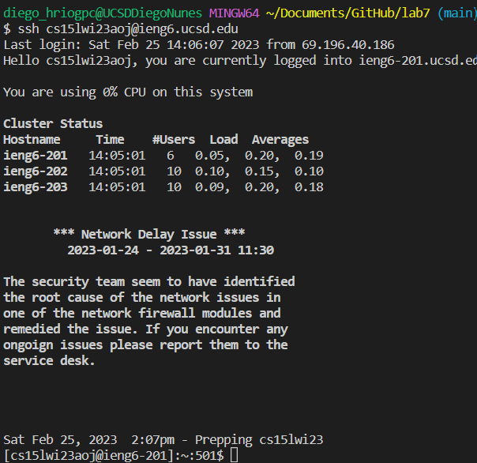
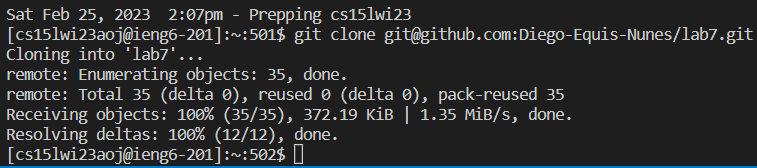
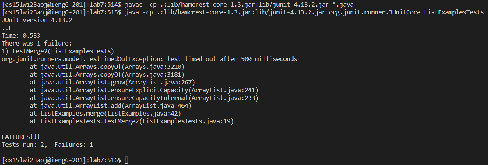
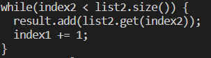
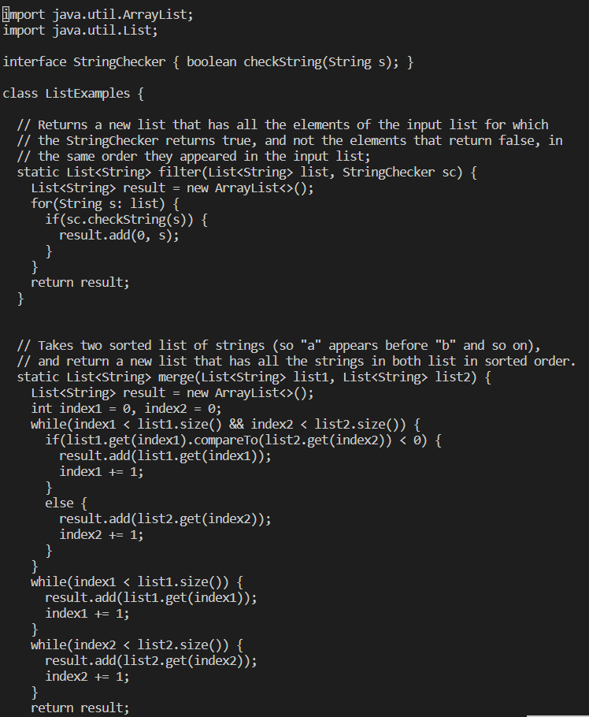
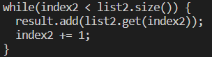
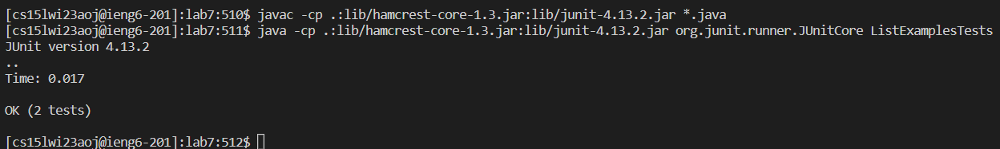
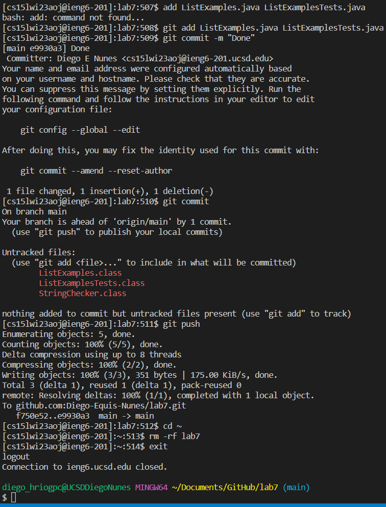

# Lab Report 4

## "Done Quick"

In week 7 of lab we were tasked to complete multiple steps to clone, commit and push files of a repository to github as fast as possible. There was a brief section of setup including removal of the need to use our password to log into our CSE 15L accounts, as well as setup for the repository we were going to manipulate. Repository setup consisted of forking the repository into our personal acocunts and making sure any clones of that repository in our IDE were removed. After all setup, we were required to do the following steps, described exactly as they are in [Lab Report 7](https://ucsd-cse15l-w23.github.io/week/week7/), as fast as possible:

1. Log into ieng6
2. Clone your fork of the repository from your Github account
3. Run the tests, demonstrating that they fail
4. Edit the code file to fix the failing test
5. Run the tests, demonstrating that they now succeed
6. Commit and push the resulting change to your Github account

## My Reproduction of Step 1 - Logging in

Keys Pressed
* `<up>`
* `<enter>`

The command `ssh cs15lwi23aoj@ieng6.ucsd.edu` was 1st up in my device's search history, so I used the up arrow to access it and hit enter to run it. The command itself logged me into my student specific CSE 15L account for the school's servers.

## My Reproduction of Step 2 - Cloning

Keys Pressed
* `<up>`
  * Was pressed 14 times
* `<enter>`

The command `git clone git@github.com:Diego-Equis-Nunes/lab7.git` was 14th up on my account's search history when on the server, so I used the up arrow to access it and hit enter to run it. This command cloned the repository `lab7` from my Github account onto the my accounts files in the server.

## My Reproduction of Step 3 - Test Failure

Keys Pressed
* `<up>`
  * Was pressed 11 times
* `<enter>`
* `<up>`
  * Was pressed 11 times
* `<enter>`

The command `javac -cp .:lib/hamcrest-core-1.3.jar:lib/junit-4.13.2.jar *.java` was 11th up on my account's search history when on the server, so I used the up arrow to access it and hit enter to run it. Running this command compiled all java files my CSE 15L account has on the `ieng6` server. Right after, I used the up arrow 11 times to access the command `java -cp .:lib/hamcrest-core-1.3.jar:lib/junit-4.13.2.jar org.junit.runner.JUnitCore ListExamplesTests` that was 11th in my history after using the previous command. I used enter to run it, which caused the file I specified in the command `ListExamplesTests.java` to be run. This file hade JUnit tests for the file that tested the file `ListExamples.java` and showed that one of the tests failed.

## My Reproduction of Step 4 - Debugging

> Bugged file `ListExamples.java`

> Error in code of file `ListExamples.java`

> Debugged file `ListExamples.java`

> Fixed code of file `ListExamples.java`

Keys Pressed
* `<up>`
  * Was pressed 14 times
* `<enter>`
* `<^O>`
* `<enter>`
* `<down>`
  * Was pressed 42 times
* `<right>`
  * Was pressed 12 times
* `<backspace>`
* `2`
* `<^X>`
* `y`
* `<enter>`

The command `nano ListExamples.java` was 14th up on my account's search history when on the server, so I used the up arrow to access it and hit enter to run it. Running this command allowed a visual representation of the file `ListExamples.java` that I specified, with multiple different options on how to interact with it present on the terminal. For example, I hit `^O` as the terminal showed and hit enter to be able to directly edit the file's text. I then used the down arrow 42 times and the right arrow 12 times to reach the error in the code of `ListExamples.java` that previously failed the JUnit tests. As shown in the images, the code in the file was iterating `index1` instead of `index2` in the for loop meant to iterate `index2`. As a result, once I was on the character `1` of `index1` to `index2` by pressing `<backspace>` to delete `1` and then pressed `2` to replace it.

## My Reproduction of Step 5 - Test Success

Keys Pressed
* `<up>`
  * Was pressed 3 times
* `<enter>`
* `<up>`
  * Was pressed 3 times
* `<enter>`

Description

## My Reproduction of Step 6 - Commit and Push

Keys Pressed
* `<up>`
  * Was pressed 14 times
* `<enter>`
* `<up>`
  * Was pressed 14 times
* `<enter>`
* `<up>`
  * Was pressed 14 times
* `<enter>`
* `<up>`
  * Was pressed 14 times
* `<enter>`
* `cd<space><~>`
* `<enter>`
* `rm<space><->rf<space>lab7`
* `<enter>`
* `exit`
* `<enter>`

Description
