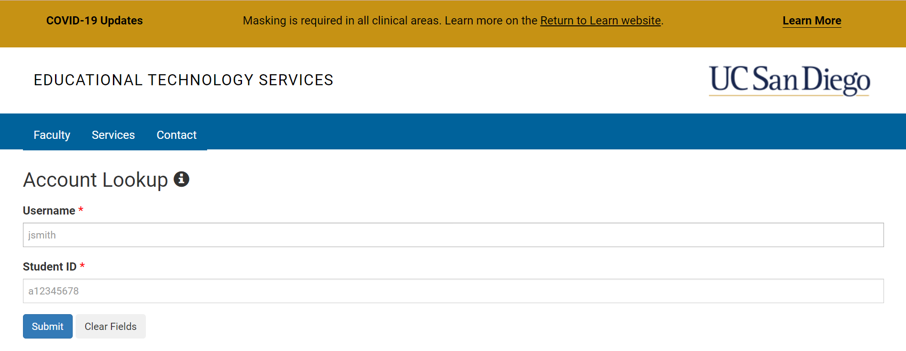
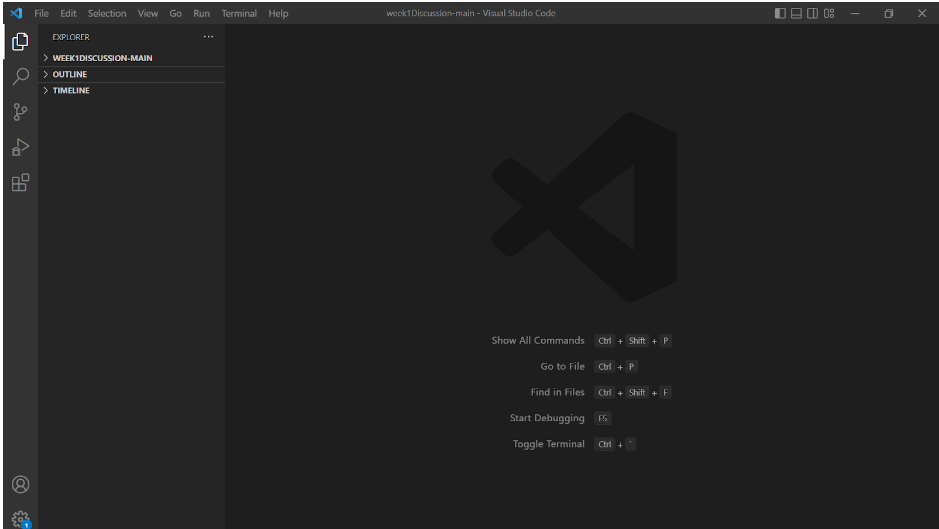
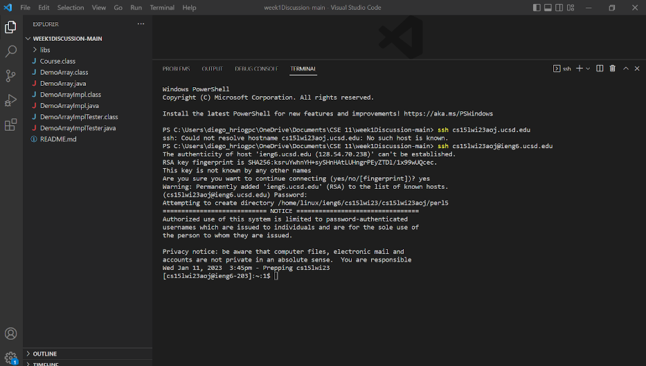
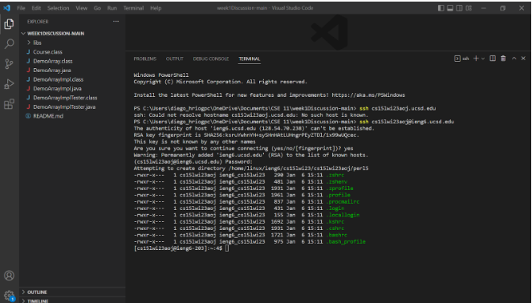
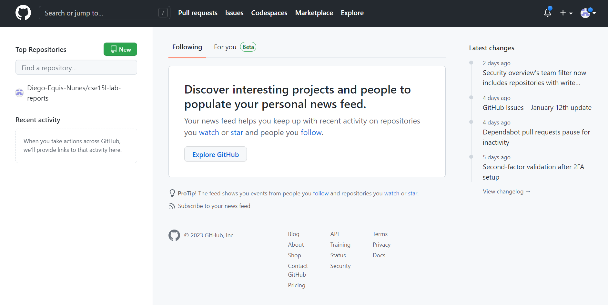

# Remote Access with Github

In this post I'll go over the steps to create a website for lap reports, specifically as an incoming CSE15L student. You'll learn how to log onto a remote server under the CSE15L course specific account.

## Part 1 - Group up

First things first you'll get into a group of 6 students mentored by a teaching assistant for the course. You'll go to google docs and access a shared document to track your team's progress.

## Part 2 - Make a course specific account

In your groups, you'll each individually use the link [CSE15L Account](https://sdacs.ucsd.edu/~icc/index.php) to access your CSE15L specific account. You''ll be sent to a page with your course ID, which you then use to create an account with it as the username and a unique password of your choosing. Don't be afraid to ask your team members for help, as I learned that asking a friend sitting close by is what ensured this part of the process went smoothly. 

## Part 3 - Download Visual Studio Code

If you don't already have it installed as I did, you'll need to install visual studio on your device using the following link [Install Visual Studio Code](https://code.visualstudio.com/). If you are unable to install for any reason, you can also log into visual studio code on the lab computers.

## Part 4 - Connect to the remote server

Once your account is created and visual studio code is involved, you will now connnect to the CSE15L remote server. You'll have to install Git on windows by using this link [Windows Install Github](https://gitforwindows.org/) and then open it in visual studio code by going to terminal and opening a new terminal. Fnially you'll type in the command "ssh cs15lwi23**zz**@ieng6.ucsd.edu" but replace the **zz** with your account for the course's letters. After doing so type "yes" to the message the terminal prompts and hit enter to complete the connection to the remote server.

## Part 5 - Test Commands

Once on the server, you can run some test commands in the terminal such as "cd ~" or "cd" or "ls - a" or the one I used which is "ls -lat" to see if you can work on the remote server. After successfully running some commands you can log off of the remote server using "control + D" or typing "exit" into the terminal.

## Part 6 - Working with Github

To be able to publish all the neat work you do on the remote server, you'll want to make a Github page to show it off. This will allow you to have a page you can link to resumes or a portfolio to show off to companies to prove your qualification in future endeavors.

## Part 7 - Create your own Github page

To make a Github page, create an account at [Github Create An Account](https://www.github.com) and then use the create a repository button once you log in. You will name the repository "cse15l-lab-reports" for the purposes of this class and then create a file within the repository. Name your first file index.md, using .md to enable markdown formatting on the file. Hit the commit file button on the bottom of the page to post the file itself. You'll have to put text into the file for anything to show once you access it again. IF you head to settings and go to the pages section, you'll need to change the branch dropdown option from "none" to "main." Save this option and after a few minutes at the top of that page, a link to your file's URL will be available for you to access. To make your file showing on the link more interesting, you'll want to explore how markdown works with information from these links [Markdown Formatting Tricks](https://commonmark.org/help/) and [The Basics of Markdown](https://www.markdownguide.org/getting-started/) or any other source of information with tutorials on it to enchance your understanding of how the formatting works.

## Part 8 - Enjoy

You have now successfully created a student account for CSE15L, connected to its respective remote server and run commands on it. You also now can access your own URL link to edit and show off any of your work for CSE15L using Github to help you prepare for any opportunities in the future. The rest lies on you to take advantage of your newly setup resources. 
.
