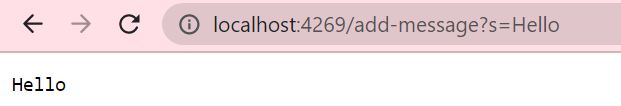
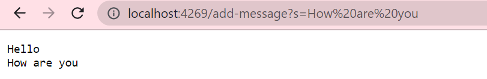
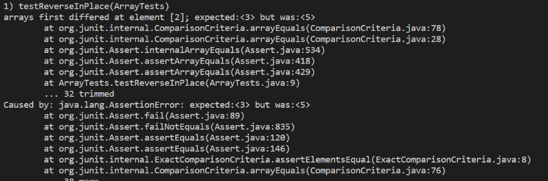
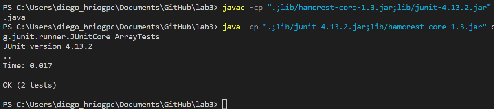

# Servers and Bugs

## Web Server

The following code block are the imports, handler class and initialized variables for the StringServer created:

```
import java.io.IOException;
import java.net.URI;
import java.util.ArrayList;

class Handler implements URLHandler {
    // String Array to be manipulated on the server
    ArrayList<String> serverList = new ArrayList<String>();
    //Initialize String that will be returned and printed to page
    String serverOutput;
```

After the imports and variables are created, the handler method for the StringServer is created and looks like the following:

```
public String handleRequest(URI url) {
        if (url.getPath().equals("/")) 
        {
            //Creates indentation between added Strings
            return String.join("\n", serverList);
        } 
        else 
        {
            //Pathing for server
            System.out.println("Path: " + url.getPath());
            //When add-message is put into url
            if (url.getPath().contains("/add-message")) 
            {
                //Take whatever comes after the equals sign as the input
                String[] parameters = url.getQuery().split("=");
                //s for s=, indicating string equals
                if (parameters[0].equals("s")) 
                {
                    //Add user inputted message
                    serverList.add(parameters[1]);
                    //Reset string that will be outputted
                    serverOutput = "";
                    //Add to string based on user input
                    for(int i = 0; i < serverList.size();i++)
                    {
                        //Add string and spacing to output String
                        serverOutput += ((serverList).get(i) + "\n");
                    }
                    //Return String to be outputted
                    return serverOutput;
                }
            }
            //Return error message if all else fails
            return "Error!";
        }
    }
}
```

Beneath the handler method for the StringServer is the StringServer class itself used to create the local host for the server. The code is as follows:

```
class StringServer {
    public static void main(String[] args) throws IOException {
        //Go through args and show error if number is not valid.
        if(args.length == 0){
            System.out.println("Missing port number! Try any number between 1024 to 49151");
            return;
        }

        int port = Integer.parseInt(args[0]);
        //Start StringServer
        Server.start(port, new Handler());
    }
}
```

The StringServer, after being fully coded can be put up on the local host. It's purpose is to add strings to the page, which can be done by manipulating the URL to handle requests. The following images show the server up, the addition of a single string and the addition of another string after that.






For the second image with "Hello" as the output, the method `handleRequest` is called. The argument in that method is the url path, shown as `url.getPath()` in the code. The values relevant in the field of that class is the input after "s" in the url path that the user types in. The values of the relevant field changed based on what the user typed in the url path, in this case being the string Hello typed in as `localhost:4269/add-message?s=Hello`.

For the second image with "Hello" as the output on the first line and "How are you" as the output on the second line, the process is relatively the same. The method `handleRequest` is called and the argument is still the url path, shown as `url.getPath()` in the code. The values relevant in the field of that class is the input after "s" in the url path just as with the first example. The values of the relevant field still changed based on what the user typed in the url path. However, in this case a string on a line already existed so what the user typed in was added on the next line in addition to what was already there. The user added "How are you" by typing in `localhost:4269/add-message?s=How%20are%20you` into the url path. It is good to note `%20` is the space character.

## Bugs

In lab 3, there was a bug with the method `testReverseInPlace()` that I was able to solve
Choose a bug from lab 3 and

The following JUnit test was a failure inducing input of the method:

```
@Test
public void testReverseInPlace() {
  int[] input1 = {3, 4, 5};
  ArrayExamples.reverseInPlace(input1);
  assertArrayEquals(new int[]{5, 4, 3}, input1);
}
```

The following JUnit test was not a failure inducing input of the method:

```
@Test
public void testReverseInPlace() {
  int[] input1 = {3};
  ArrayExamples.reverseInPlace(input1);
  assertArrayEquals(new int[]{3}, input1);
}
```

The associated code for both JUnit tests, that occured before the bug was fixed, was the method `reverseInPlace()`

```
static void reverseInPlace(int[] arr) {
    int[] tempArray = new int[arr.length];
    for(int i = 0; i < arr.length; i += 1) {
      tempArray[0] = arr[i];
      arr[i] = arr[arr.length - i - 1];
    }
  }
```

The symtpom of the failure inducing input mentioned above can been seen in the image below:



The symtpom of the successful input mentioned above can been seen in the image below:



The following code is how the `testReverseInPlace()` code was written it was buggy:

```
static void reverseInPlace(int[] arr) {
    int[] tempArray = new int[arr.length];
    for(int i = 0; i < arr.length; i += 1) {
      tempArray[0] = arr[i];
      arr[i] = arr[arr.length - i - 1];
    }
  }
```

The following code is how the `testReverseInPlace()` code was written when the bug was fixed:

```
static void reverseInPlace(int[] arr) {
    int[] tempArray = new int[arr.length];
    for(int i = 0; i < arr.length/2; i += 1) {
      tempArray[0] = arr[i];
      arr[i] = arr[arr.length - i - 1];
      arr[arr.length - i - 1] = tempArray[0];
    }
  }
```

The way the changes fixed the issue where as follows. The iteration length of `arr.length` was changed to `arr.length/2` or halved in order to prevent the array from swapping its elements twice. Since the array swapped the firstmost elements with the lastmost ones, it had to stop iterating through that procedure halfway through the array list's length to be effective. I also added the line 'arr[arr.length - i - 1] = tempArray[0];' in order to store the firstmost elements before they got replaced by the lastmost elements. This allowed for the replacement of the lastmost elements with the stored firstmost element, rather than the replaced firstmost element (which was simply the lastmost element that just repaced it) as the previous code was doing when it was bugged. As a result, the code no longer swapped the firstmost and lastmost elements twice as much as it should nor swaped the incorrect elements any longer.

## Learning Experience

From creating and running a web server to debugging code based on JUnit tests, I learned a lot about hosting a server and making sure it runs properly. I did not know that my computer could host and run its own server in any capacity, which is something I learned and was excited about from week 2's lab. I also learned a lot about how to navigate url paths since I had to consider how they handled commands for my coded StringServer to run properly.
